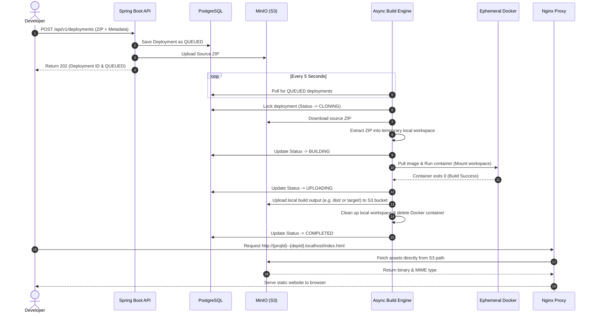

# ForgeDeploy Architecture Flow 🏗️

This document describes the internal architecture of ForgeDeploy, details how deployments are processed, explains the database schema, and explains how requests are routed and served.

---

## 🗺️ System Architecture

ForgeDeploy consists of several key components working together:
1. **Spring Boot Backend:** Exposes REST endpoints for user authentication, project registration, and zip package deployments. Handles the asynchronous build orchestration.
2. **MinIO Object Storage:** Stores the original uploaded source code zip archives and the compiled static site assets.
3. **PostgreSQL Database:** Persists information about users, projects, and deployments.
4. **Docker Daemon:** Executes build commands inside isolated, ephemeral containers mapping host workspaces into the container.
5. **Nginx Reverse Proxy:** Routes user requests for wildcard subdomains directly to MinIO and serves SPA applications with proper MIME types.

### Deployment Lifecycle Diagram

The diagram below details the end-to-end lifecycle of a deployment:



---

## 🗄️ Database Schema & Entities

The database schema is managed via Flyway migrations (`db/migration/`) and defined by JPA entities in the backend:

1. **`UserInfo` (`users` table):**
   - Stores users registered via credentials (email/password hash) or linked via GitHub OAuth (stores `github_id`, `github_username`, and `github_access_token`).
2. **`Project` (`projects` table):**
   - Represents a logical project created by a user.
   - Tied to a `UserInfo` owner.
3. **`Deployment` (`deployments` table):**
   - Represents a specific deployment run/job of a project.
   - Contains fields for `source_type` (e.g. `ZIP`), `project_type` (e.g. `NODE` or `JAVA`), `status` (`QUEUED`, `CLONING`, `BUILDING`, `UPLOADING`, `COMPLETED`, `FAILED`), and build configs (`build_command`, `output_directory`).
4. **`DeploymentJob` (`deployment_jobs` table):**
   - Future-use scheduling table.

---

## 🏗️ Build Execution Details

ForgeDeploy runs builds in isolated Docker containers:

* **Node.js Build Strategy (`NODE`):**
  - **Image:** `node:20-alpine`
  - **Default Command:** `npm ci && npm run build`
  - **Default Output:** `dist`
* **Java Maven Build Strategy (`JAVA`):**
  - **Image:** `maven:3.9.16-eclipse-temurin-25-alpine`
  - **Default Command:** `mvn clean package -DskipTests`
  - **Default Output:** `target`

During the build:
1. A temporary directory is created for the deployment under `/tmp/forgedeploy-workspaces/{deploymentId}` (configured via `WorkspaceService`).
2. The source ZIP is downloaded and unpacked into the directory.
3. A Docker container is created with a volume mount binding the local workspace directory to `/app` inside the container.
4. The strategy-specific build command is executed within `/app` in the container.
5. Once the container finishes with exit code `0`, the contents of the output directory (`dist/` or `target/`) are read and uploaded recursively to MinIO.
6. The container is force-removed and the local workspace directory is deleted.

---

## 🌐 Serving Routing Details (Nginx)

Nginx handles both wildcard subdomain mapping and SPA routing:

### Wildcard Routing
Nginx parses subdomains using a regular expression:
```nginx
server_name  ~^(?<proj_id>.+?)--(?<dep_id>.+?)\.localhost$;
```
This extracts `proj_id` and `dep_id` and translates requests into direct S3 path lookups:
```nginx
proxy_pass http://forge-minio:9000/forge-deploy-assets/projects/$proj_id/deployments/$dep_id/artifacts$uri;
```

### SPA Fallback Routing
To support SPAs (like React Router, Vue Router), Nginx intercepts 404 errors and returns the index file:
```nginx
location / {
    proxy_intercept_errors on;
    error_page 404 = @spa_fallback;
    ...
}

location @spa_fallback {
    proxy_pass http://forge-minio:9000/forge-deploy-assets/projects/$proj_id/deployments/$dep_id/artifacts/index.html;
    ...
}
```
This guarantees that clientside routing works perfectly without breaking deep links.
