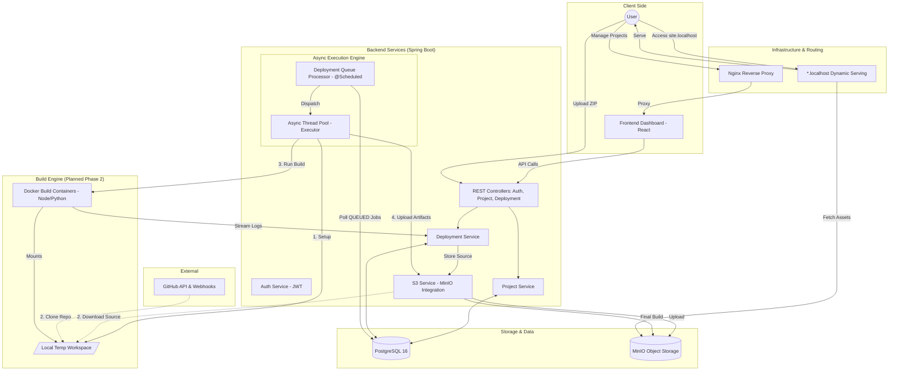

# ForgeDeploy Architecture

This document describes the high-level architecture and component interactions of the ForgeDeploy platform.

## Architecture Diagram

## Component Breakdown

### 1. Nginx (Gateway)

* Acts as the entry point for both the management dashboard and the deployed user sites.
* **Phase 3** will configure it to handle wildcard subdomains (`*.localhost`) to route traffic to specific deployments.

### 2. Spring Boot Backend

* **Controllers:** Handle the "Control Plane"—creating projects, triggering deployments, and user auth.
* **DeploymentQueueProcessor:** A background worker that prevents the API from freezing during long builds. It polls the
  database every 5 seconds for new jobs.
* **S3 Service:** The bridge to MinIO. It handles everything from storing initial ZIP uploads to saving the final
  production-ready artifacts.

### 3. PostgreSQL

* Stores metadata: User accounts, Project settings, Deployment history, and build durations.

### 4. MinIO (The "Warehouse")

* Stores the "Data Plane": The raw source code ZIPs and the final bundled `dist` or `build` folders.

### 5. Build Engine (Phase 2)

* **Workspace:** A temporary folder on the server where the code is extracted/cloned.
* **Docker:** Used to isolate the build. If a user runs a malicious build script, it only affects the short-lived
  container, not your main server.

### 6. GitHub Integration (Phase 4)

* Automates the flow so that a `git push` triggers the backend to start the cycle automatically.
